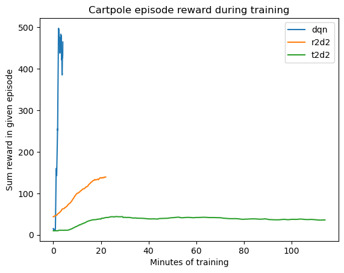
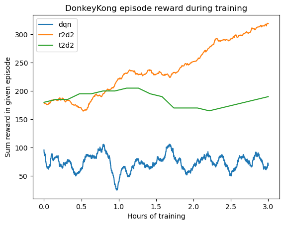
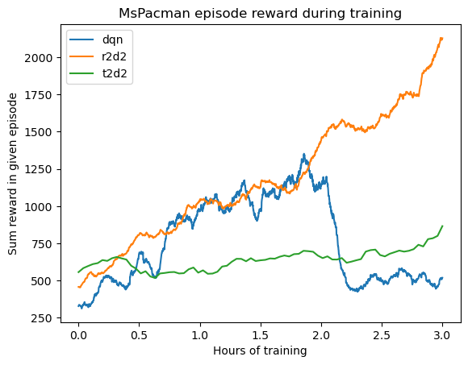
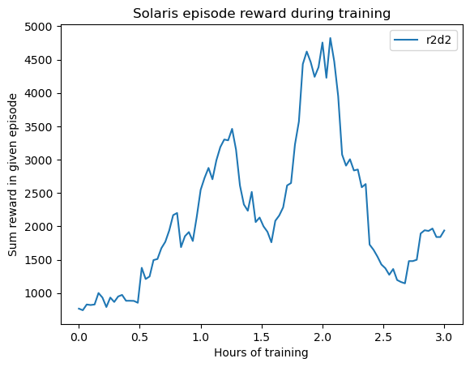

# R2D2 with Transformers

This project was an attempt to check, whether Transformer architecture would be better in RL environments compared to RNN used in R2D2.

R2D2 with swapped GRU for Transformer is called **T2D2**.
## Usage/Examples

Notebooks are named after what algorithm they use and in which environment. E.g. `r2d2-cartpole`. Each notebook is independent, containing all the code required to work. Just run the notebook you want.

`results.ipynb` contains code that aggregates results and shows them in plots.

Images show in this README file are inside `images` folder.
## Experiments

For comparison, on the same environment there was trained DDQN, R2D2 and T2D2. Each notebook containing selected algorithm with environment was trained for about 3 hours (except cartpole). Results from this experiments are present under the results section.
## Results

For small models Transformers are worse fit for RL environments, as they were built primarly to be able to scale really well into huge models, and in RL typically small models are used (like in this experiments). Transformers require longer training times to come to any level of solving environments, achieving lower final score.

Also transformers are best when they have all the inputs at the same time, so they can process them simultaneously. In RL we only get one observation per environment step, so we need Transformer to act as semi auto-regressive model.

Here are results:

### Cartpole

### DonkeyKong

### MsPacman

### Solaris (only R2D2, as T2D2 and DQN couldn't get any progress)

## Acknowledgements

 - [R2D2 implementation](https://github.com/ZiyuanMa/R2D2)
 - [Pytorch docs](https://pytorch.org/docs/stable/nn.html)
